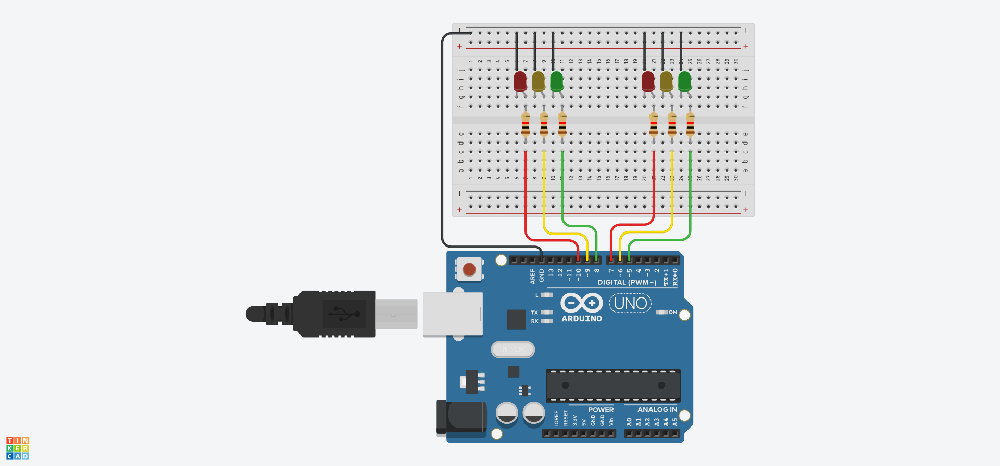

# Arduino Traffic Light Control System

This project simulates a traffic light control system using an Arduino and two sets of traffic lights. The lights change between red, yellow, and green, with adjustable durations for the different lights.

## Components
- Arduino Uno (or compatible)
- 6 LEDs (2 red, 2 yellow, 2 green)
- Resistors (220Ω recommended)
- Breadboard and jumper wires

## Schematic diagram

## Circuit
- **Traffic Light 1 (Red, Yellow, Green)**: Connected to pins `10`, `9`, and `8`.
- **Traffic Light 2 (Red, Yellow, Green)**: Connected to pins `7`, `6`, and `5`.
- The LEDs for both traffic lights will alternate, with one set showing red while the other shows green.

## How it Works:
1. The system starts with both traffic lights initialized. One will display green while the other displays red.
2. The lights change after a set duration: green or red lasts for 10 seconds, yellow lasts for 3 seconds.
3. The cycle alternates between the traffic lights, ensuring synchronization where one shows red while the other shows green, and vice versa.

## License
This project is open-source and available under the [MIT License](LICENSE).
